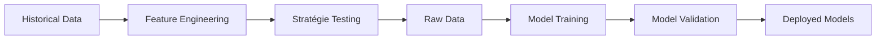

# Documentation sur l'entraînement IA

## 🧠 Architecture d'Intelligence Artificielle

### Vue d'ensemble

Cubi-sniper utilise trois types de modèles pour la prise de décision :

1. **Modèle ROI/sec** : Prédit le ROI potentiel par seconde 
2. **Modèle de sortie** : Prédit le moment optimal pour vendre
3. **OCaml Scoring** : Scoring rapide et contrôlable

### Pipeline d'entraînement



## 📚 Données d'entraînement

### Sources de données

- **Historique des trades** : Résultats des simulations
- **Données Jupiter** : Pools, liquidité, volumes
- **Métriques extraites** :
  - Temps jusqu'au pool
  - Vitesse de liquidité
  - Ratio buy/sell
  - Volatilité 1-minute
  - Concentration des holders
  - Score créateur

### Format des données

```json
{
  "mint": "...",
  "time_since_launch": 45.2,
  "holders": 23,
  "volatility": 0.15,
  "creator_score": 0.85,
  "roi_per_sec": 0.023,
  "roi": 1.5,
  "time_held": 65,
  "exit_reason": "stagnation"
}
```

## 🎯 Backtesting

### Processus

1. **Collecte historique** : Datasets de tokens passés
2. **Simulation multi-stratégie** : Test de toutes les combinaisons
3. **Métriques calculées** :
   - ROI moyen/token  
   - Taux de victoire
   - Drawdown maximum
   - Temps de hold moyen
4. **Ranking des stratégies** : Selon performance ROI/sec

### Scripts

```bash
# Lancer le backtesting sur tous les datasets
npm run train

# Lancer sur un token spécifique
ts-node scripts/backtester.ts --token SHITMEME.json
```

## 🛠️ Entraînement des Modèles

### Modèle ROI/sec

**Objectif** : Prédire le rendement potentiel par seconde

**Features** :
- time_since_launch
- holders
- volatility  
- creator_score

**Algorithme** : Ridge Regression avec StandardScaler

**Métriques** :
- R² score
- MAE (Mean Absolute Error)
- MSE (Mean Squared Error)

### Modèle de Sortie

**Objectif** : Classifier si c'est le bon moment pour sortir

**Features** :
- time_since_buy
- roi
- roi_per_sec
- creator_score
- price trajectory indicators

**Algorithme** : Gradient Boosting Classifier

**Métriques** :
- Accuracy
- Precision/Recall
- F1-score
- Confusion matrix

### OCaml Scoring

**Objectif** : Scoring rapide avec règles pondérées

**Features** :
- liquidity
- holders
- ai_score  
- volatility_1m
- buy_sell_ratio

**Poids** : Configurables via weights.json

## 🔄 Réentraînement

### Déclencheurs

1. **Périodique** : Tous les jours à 3h AM
2. **Quantité de données** : Tous les 10000 nouveaux trades
3. **Performance** : Si accuracy < 80%
4. **Manuel** : Via endpoint /retrain

### Stratégie

- **Cross-validation** : 5-fold pour validation robuste
- **Hyperparameter tuning** : Grid search automatisé
- **A/B testing** : Modèle challenger vs modèle de production
- **Rollback** : Retour au modèle précédent si dégradation

### Monitoring

- **Drift detection** : Alerte si distribution change
- **Performance tracking** : Prometheus/Grafana 
- **Alertes** : Slack/Email sur dégradation

## 📊 Visualisation

### Heatmaps

- **Axes** : Time held vs ROI/sec
- **Couleur** : Probabilité de sortie
- **Taille** : Volume des trades

### Distributions

- **ROI histogram** : Distribution normale vs réelle
- **Hold time** : Temps optimal de détention
- **Strategy win-rate** : Par stratégie

### Dashboard

- **Graphiques temps réel** : Chart.js
- **KPIs** : Métriques clés en live
- **Logs** : Stream des décisions

## 🎛️ Hyperparamètres

### Ridge Regression
```python
{
  "alpha": 0.5,
  "normalize": true,
  "max_iter": 1000
}
```

### Gradient Boosting
```python
{
  "n_estimators": 200,
  "learning_rate": 0.1,
  "max_depth": 3,
  "subsample": 0.8
}
```

### Stratégie Weights
```json
{
  "w_liquidity": 1.0,
  "w_holders": 1.2,
  "w_ai_score": 0.8,
  "w_volatility": 1.5,
  "w_buy_sell_ratio": 0.9
}
```

## 🔧 Maintenance

### Checklist quotidienne

- [ ] Vérifier la performance des modèles
- [ ] Contrôler les logs d'entraînement
- [ ] Valider la qualité des données
- [ ] Surveiller les alertes

### Actions périodiques

- **Hebdomadaire** : 
  - Revoir les métriques d'entraînement
  - Ajuster les hyperparamètres si besoin
  
- **Mensuel** :
  - Audit complet des modèles
  - A/B test de nouvelles architectures
  - Nettoyage des anciennes données

## 📖 Références

1. **Machine Learning** : Scikit-learn, PyTorch Documentation
2. **Solana Data** : Jupiter v6 API Documentation  
3. **Time Series** : ARIMA, Prophet Guidelines
4. **Trading** : Quantitative Finance Textbooks

---

**Maintenu par** : Équipe AI Cubi-sniper  
**Dernière mise à jour** : 2025-05-05